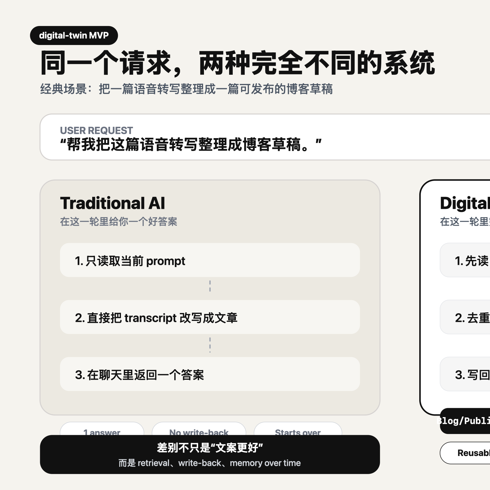

# digital-twin

用 3 步，从 0 搭一个你自己的 digital twin MVP。

这个仓库不是给你一堆提示词。

它是帮你搭出一个最小可用链路：有原始素材，有知识库入口，有写回结果，有 learning loop。

## 3 步开始

### 1. 复制这个最小工作区

从 [`playground/`](./playground) 开始。

你会得到：

- 一个最小 `AGENTS.md`
- 一份 `raw/thoughts/` 原始素材
- 一个最小 `wiki/`
- 一个已有 `Blog/Published/`
- 一个已有 `agent-learnings/`

也就是说，你一开始就不是空仓。

### 2. 跑第一次任务

直接用 [`playground/FIRST_PROMPT.md`](./playground/FIRST_PROMPT.md) 里的 prompt。

这一步你会得到：

- 一篇新的博客草稿
- 一条新的 learning note

如果你只得到了聊天里的一段答案，而没有新文件，那这次运行就不算成功。

### 3. 换成你自己的内容

把 `playground/raw/thoughts/` 里的素材换成你的语音转写、笔记、会议记录或者草稿。

再把 `playground/wiki/` 和 `Blog/Published/` 里的内容慢慢替换成你自己的知识和输出。

这一步你会得到：

- 你自己的最小 knowledge base
- 你自己的第一版 digital twin workflow

到这里，你已经不是在看 demo，而是在玩你自己的系统了。

## 先看一眼它和传统方式差在哪

经典场景只看一个就够了：

> 把一篇语音转写整理成一篇可发布的博客草稿。

传统 AI：

- 读取当前 prompt
- 直接改写 transcript
- 在聊天里返回一个答案

`digital-twin`：

- 先读已有系统
- 判断重复和 throughline
- 把结果写回草稿、summary、learning note

所以差别不是“写得更漂亮”。

差别是它开始形成：

- retrieval
- write-back
- memory over time

## 这个仓库里最重要的文件

如果你只想搭自己的 MVP，先看这几个：

- [`playground/README.md`](./playground/README.md)
- [`playground/FIRST_PROMPT.md`](./playground/FIRST_PROMPT.md)
- [`playground/AGENTS.md`](./playground/AGENTS.md)
- [`TRY_IT.md`](./TRY_IT.md)

其他内容都是辅助这条主链路的：

- [`SKILL.md`](./SKILL.md): skill 的完整定义
- [`examples.md`](./examples.md): 更多例子
- [`WORKFLOW.md`](./WORKFLOW.md): 背后的 workflow
- [`THESIS.md`](./THESIS.md): 更完整的 big why

## 什么才算你真的跑起来了

不是你觉得这个概念挺有意思。

而是你已经能在本地明显看到这几样东西：

- 一个 raw material 进入系统
- 一个新输出被写回 `Blog/Published/`
- 一个新规则被写回 `agent-learnings/`
- 下一次任务不再完全从零开始

如果这四件事发生了，你的 digital twin MVP 就已经成立了。
