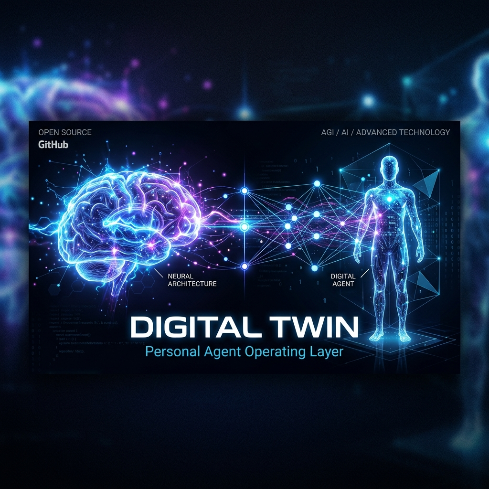
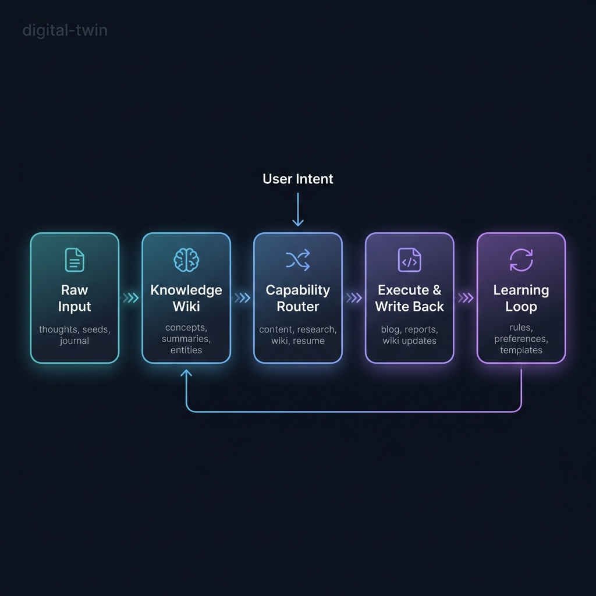
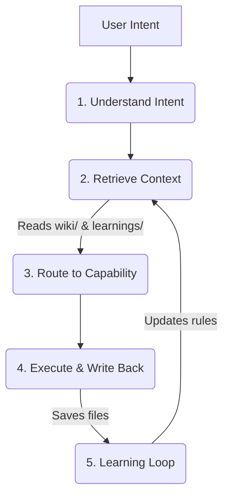

  

  <h1 align="center">digital-twin</h1>
  

    <strong>Your Personal Agent Operating Layer.</strong> 
    Build an AI that inherits your logic, style, and memory, instead of just answering prompts.
  

  

    
    
    
  

## 🚀 Why `digital-twin`?

Most AI agents start from scratch every time you talk to them. They don't know what you know, how you think, or where you save things. 

**`digital-twin` is different.** It's not just a set of prompts. It's an **operating model** that gradually externalizes your workflow so an agent can inherit it.

- 🛑 **Traditional AI:** Prompt -> Answer -> End.
- 🟢 **Digital Twin:** Understand Intent -> Retrieve your Knowledge -> Route to your Skills -> Execute -> **Write Back & Learn**.

  
  
<em>How the system works: Raw Input → Knowledge Wiki → Capability Router → Execute & Write Back → Learning Loop</em>

## 🛠 Capability Routing — The Brain of Your Twin

> What makes a digital twin powerful is not a mega-prompt — it's **knowing which skill to use for which task**.

The twin doesn't do everything the same way. It detects your intent, then routes to the right capability module — each with its own workflow, constraints, and output format.

| Intent | Capability | What It Does |
|--------|-----------|-------------|
| 写文章、整理口语记录 | [Content Creation](./capabilities/content-creation.md) | Reads wiki & style guide → drafts → publishes to `Blog/` |
| 刷新知识库、ingest 资料 | [Wiki Management](./capabilities/wiki-management.md) | Scans `raw/` for increments → creates summaries → updates index |
| 研究代码库、分析架构 | [Codebase Research](./capabilities/codebase-research.md) | Builds mental model → extracts value → produces research report |
| 改网站、优化 SEO | [Site Improvement](./capabilities/site-improvement.md) | Checks existing positioning → edits files → writes back rules |
| 改简历、JD 分析 | [Resume Craft](./capabilities/resume-craft.md) | Reads career context → tailors to JD → outputs draft |
| 复盘、沉淀经验 | [Learning Loop](./capabilities/learning-loop.md) | Asks 4 questions → extracts durable rules → writes to wiki |
| review 知识库、聚类整理 | [Knowledge Growth](./capabilities/knowledge-growth.md) | Syncs state → digests new notes → clusters topics → reviews timeline |

Each capability is a standalone file. You can add, remove, or modify them without touching the core system.

## ✨ Core Features

- **🧠 Deep Retrieval:** Pulls from your personal `wiki/` and past `agent-learnings/` before acting.
- **🛠 Capability Routing:** Uses specific workflows (Skills) for writing, coding, or researching instead of a generic mega-prompt.
- **💾 Write-back System:** Generates real files (markdown, code) in your file system, not just chat bubbles.
- **🔄 Learning Loop:** Extracts new rules and preferences from every session so it gets smarter next time.

## 🌟 Showcase: The "Elon Musk" Digital Clone

We don't just talk about it — we built a complete demo to prove it. The [Elon Musk Digital Twin](./examples/elon-musk) shows how the system uses real public resources to operate with his logic.

### What's in the demo?

- **4 raw sources** — Starship engineering feedback, Tesla production lessons, SpaceX culture, AI risk stance
- **4 wiki pages** — Management rules, First Principles, Decision-Making framework, Communication style
- **Each resource has a reason** — See [`SHOWCASE.md`](./examples/elon-musk/SHOWCASE.md) for why each was collected and how they connect

### Before vs After (quick preview)

| | Without wiki | With wiki loaded |
|---|---|---|
| **Opening** | "Dear Team, I wanted to provide an update..." | "The tile process has an Idiot Index problem." |
| **Instruction** | "I'd like to suggest we explore improvements..." | "DELETE the manual gap check. Effective immediately." |
| **Sign-off** | "Best regards, Elon" | "This is not optional. Elon" |

  <a href="./examples/elon-musk"><strong>👉 Explore the Full Elon Musk Demo</strong></a> · <a href="./examples/elon-musk/SHOWCASE.md"><strong>📖 Read the Showcase</strong></a>

## 🏗 Architecture Workflow

## 🏁 Quick Start (Build Your MVP)

You don't need a massive database to start. You can build your MVP in 3 steps:

### 1. Initialize the Workspace
Start with the [`playground/`](./playground) folder. It provides a minimal structure:
- `AGENTS.md`
- `raw/thoughts/` (raw materials)
- `wiki/` (knowledge base)
- `agent-learnings/` (memory)

### 2. Run Your First Task
Use [`playground/FIRST_PROMPT.md`](./playground/FIRST_PROMPT.md) in Cursor, Claude, or your LLM runner of choice.
You will see it generate actual files (a blog post, a learning note) instead of just chatting.

### 3. Clone Yourself
Replace the files in `playground/raw/thoughts/` and `wiki/` with your own notes, transcripts, and rules. Watch the twin adapt to you.

## 📚 Documentation

Dive deeper into the philosophy and architecture:
- [📖 **Documentation Website**](https://stevenchouai.github.io/digital-twin/)
- [`THESIS.md`](./THESIS.md): The core philosophy behind the Personal Agent Operating Layer.
- [`WORKFLOW.md`](./WORKFLOW.md): How the 5-step loop actually runs under the hood.
- [`SKILL.md`](./SKILL.md): How to define specific capabilities.

## 🤝 Contributing
Contributions are welcome! Please read our contributing guidelines and submit PRs.

## 📄 License
This project is licensed under the MIT License.
