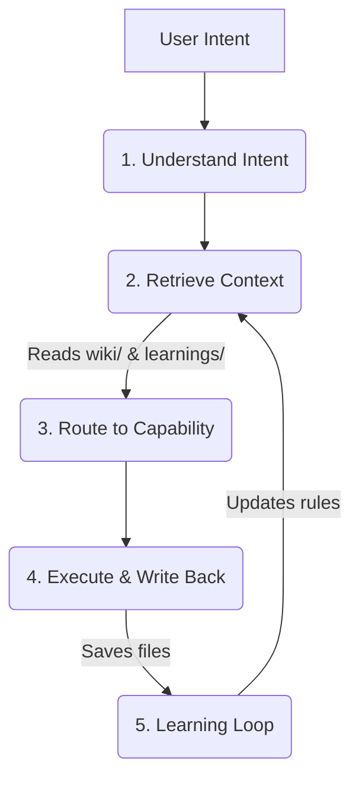

  

  <h1 align="center">digital-twin</h1>
  

    <strong>Your Personal Agent Operating Layer.</strong> 
    Build an AI that inherits your logic, style, and memory, instead of just answering prompts.
  

  

    
    
    
  

## 🚀 Why `digital-twin`?

Most AI agents start from scratch every time you talk to them. They don't know what you know, how you think, or where you save things. 

**`digital-twin` is different.** It’s not just a set of prompts. It’s an **operating model** that gradually externalizes your workflow so an agent can inherit it.

- 🛑 **Traditional AI:** Prompt -> Answer -> End.
- 🟢 **Digital Twin:** Understand Intent -> Retrieve your Knowledge -> Route to your Skills -> Execute -> **Write Back & Learn**.

## ✨ Core Features

- **🧠 Deep Retrieval:** Pulls from your personal `wiki/` and past `agent-learnings/` before acting.
- **🛠 Capability Routing:** Uses specific workflows (Skills) for writing, coding, or researching instead of a generic mega-prompt.
- **💾 Write-back System:** Generates real files (markdown, code) in your file system, not just chat bubbles.
- **🔄 Learning Loop:** Extracts new rules and preferences from every session so it gets smarter next time.

## 🌟 Showcase: The "Elon Musk" Digital Clone

We don't just talk about it—we built a demo to prove it. Check out the [Elon Musk Digital Twin Demo](./examples/elon-musk) to see how the system uses Elon's public speeches, tweets, and first-principles thinking to operate just like him.

  <a href="./examples/elon-musk"><strong>👉 Explore the Elon Musk Demo</strong></a>

## 🏗 Architecture Workflow

## 🏁 Quick Start (Build Your MVP)

You don't need a massive database to start. You can build your MVP in 3 steps:

### 1. Initialize the Workspace
Start with the [`playground/`](./playground) folder. It provides a minimal structure:
- `AGENTS.md`
- `raw/thoughts/` (raw materials)
- `wiki/` (knowledge base)
- `agent-learnings/` (memory)

### 2. Run Your First Task
Use [`playground/FIRST_PROMPT.md`](./playground/FIRST_PROMPT.md) in Cursor, Claude, or your LLM runner of choice.
You will see it generate actual files (a blog post, a learning note) instead of just chatting.

### 3. Clone Yourself
Replace the files in `playground/raw/thoughts/` and `wiki/` with your own notes, transcripts, and rules. Watch the twin adapt to you.

## 📚 Documentation

Dive deeper into the philosophy and architecture:
- [📖 **Documentation Website**](https://stevenchouai.github.io/digital-twin/)
- [`THESIS.md`](./THESIS.md): The core philosophy behind the Personal Agent Operating Layer.
- [`WORKFLOW.md`](./WORKFLOW.md): How the 5-step loop actually runs under the hood.
- [`SKILL.md`](./SKILL.md): How to define specific capabilities.

## 🤝 Contributing
Contributions are welcome! Please read our contributing guidelines and submit PRs.

## 📄 License
This project is licensed under the MIT License.
