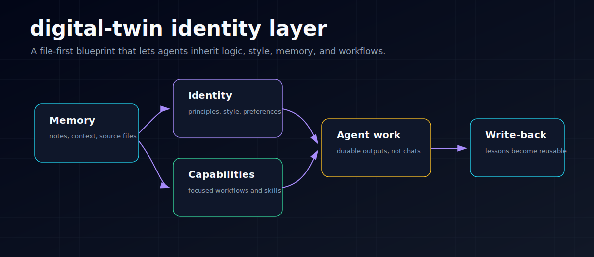
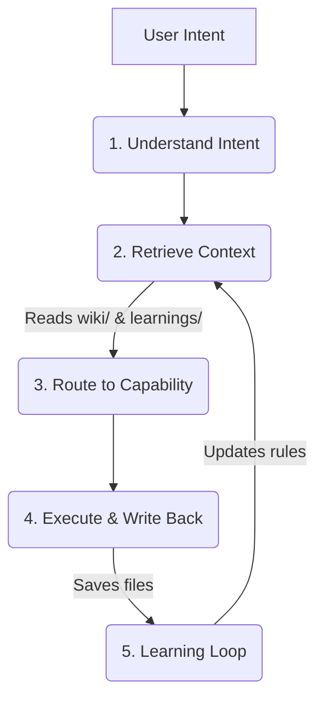

  

  <h1 align="center">digital-twin</h1>
  

    <strong>Your Personal Agent Operating Layer.</strong> 
    Build an AI that inherits your logic, style, and memory, instead of just answering prompts.
  

  

    
    
    
  

## TL;DR

  

`digital-twin` is a file-first blueprint for building a personal agent operating layer: keep your knowledge in inspectable files, route work to focused capabilities, produce durable outputs, and write reusable lessons back into the system.

## Part of StevenOS

`digital-twin` is the **identity layer** in Steven's Personal AI Operating System.

- **Upstream:** Obsidian knowledge, raw notes, personal principles, and style files.
- **This layer:** turns memory into explicit identity, capability routing, and reusable workflows.
- **Downstream:** Hermes/OpenClaw-style agents that can act with continuity instead of starting from blank prompts.
- **Proof:** [`THESIS.md`](./THESIS.md), [`SKILL.md`](./SKILL.md), [`capabilities/`](./capabilities), and [`playground/`](./playground).

If you only have 5 minutes, start here:

1. Try the [5-minute twin demo](./docs/demo/five-minute-twin.md) to inspect the sample files, run one prompt, and check the write-back loop.
2. Read the [thesis](./THESIS.md) to understand the operating model.
3. Open [`playground/`](./playground) to see the file structure of a personal twin.
4. Follow [TRY_IT.md](./TRY_IT.md) to run a small writing/research workflow against local files.
5. Browse the live docs: <https://stevenchouai.github.io/digital-twin/>.

## 🚀 Why `digital-twin`?

Most AI agents start from scratch every time you talk to them. They don't know what you know, how you think, or where you save things. 

**`digital-twin` is different.** It is not a prompt pack, a generic RAG demo, or a chatbot persona. It is a **Personal Agent Operating Layer blueprint**: a file-based template for making an agent inherit your long-running knowledge, workflows, skills, and learning loop.

This repository currently ships the operating model and workspace structure, not a hosted runtime. The point is to show how to organize a personal AI system so any capable coding agent or AI IDE can run it against real files.

- 🛑 **Traditional AI:** Prompt -> Answer -> End.
- 🟢 **Digital Twin:** Understand Intent -> Retrieve your Knowledge -> Route to your Skills -> Execute -> **Write Back & Learn**.

  
  
<em>How the system works: Raw Input → Knowledge Wiki → Capability Router → Execute & Write Back → Learning Loop</em>

## 🛠 Capability Routing — The Brain of Your Twin

> What makes a digital twin powerful is not a mega-prompt — it's **knowing which skill to use for which task**.

The twin doesn't do everything the same way. It detects your intent, then routes to the right capability module — each with its own workflow, constraints, and output format.

| Intent | Capability | What It Does |
|--------|-----------|-------------|
| 写文章、整理口语记录 | [Content Creation](./capabilities/content-creation.md) | Reads wiki & style guide → drafts → publishes to `Blog/` |
| 刷新知识库、ingest 资料 | [Wiki Management](./capabilities/wiki-management.md) | Scans `raw/` for increments → creates summaries → updates index |
| 研究代码库、分析架构 | [Codebase Research](./capabilities/codebase-research.md) | Builds mental model → extracts value → produces research report |
| 改网站、优化 SEO | [Site Improvement](./capabilities/site-improvement.md) | Checks existing positioning → edits files → writes back rules |
| 改简历、JD 分析 | [Resume Craft](./capabilities/resume-craft.md) | Reads career context → tailors to JD → outputs draft |
| 复盘、沉淀经验 | [Learning Loop](./capabilities/learning-loop.md) | Asks 4 questions → extracts durable rules → writes to wiki |
| review 知识库、聚类整理 | [Knowledge Growth](./capabilities/knowledge-growth.md) | Syncs state → digests new notes → clusters topics → reviews timeline |

Each capability is a standalone file. You can add, remove, or modify them without touching the core system.

## ✨ Core Features

- **🧠 Personal Wiki First:** Pulls from your `wiki/`, prior outputs, style rules, and `agent-learnings/` before acting.
- **🧭 Intent Routing:** Classifies the request before execution, then chooses the right capability instead of forcing everything through one mega-prompt.
- **🛠 Skills / Capabilities:** Keeps reusable workflows in standalone capability files for writing, research, wiki management, resume work, site improvement, and learning loops.
- **💾 Write-back System:** Generates durable files in your workspace, not just chat bubbles.
- **🔄 Learning Loop:** Distills new preferences, failure modes, and reusable rules into future context.

## 📈 Why This Fits the 2026 Agent Trend

The market is moving from "ask a model a question" toward **personal agent systems** that can remember context, call tools, and operate inside a user's real workflow. `digital-twin` maps that trend into a practical local blueprint:

| Trend | What it means in practice | How this repo handles it today |
|-------|---------------------------|--------------------------------|
| Agent memory | Useful agents need durable context across sessions, not just a longer chat window. | Uses `wiki/`, published outputs, and `agent-learnings/` as inspectable memory files. |
| MCP / tools / skills | Agents increasingly need standard ways to reach files, apps, tools, and repeatable workflows. | Models capabilities as modular skill files that can later be connected to MCP servers or AI IDE tools. |
| Personal AI workflow | The differentiator is not a generic assistant; it is whether the agent follows one person's actual operating model. | Routes by intent, reads Steven-style assets, executes in the workspace, then writes back rules. |
| Local-first / BYO knowledge | Users need control over private notes, project files, and knowledge boundaries. | Keeps the template file-based and bring-your-own-knowledge instead of requiring a proprietary memory store. |

The project is intentionally honest about its current state: it is a **blueprint/template** for a Personal Agent OS, not a claim that every connector, scheduler, memory service, or UI has already been implemented.

## 🌟 Showcase: The "Elon Musk" Digital Clone

We don't just talk about it — we built a complete demo to prove it. The [Elon Musk Digital Twin](./examples/elon-musk) shows how the system uses real public resources to operate with his logic.

### What's in the demo?

- **4 raw sources** — Starship engineering feedback, Tesla production lessons, SpaceX culture, AI risk stance
- **4 wiki pages** — Management rules, First Principles, Decision-Making framework, Communication style
- **Each resource has a reason** — See [`SHOWCASE.md`](./examples/elon-musk/SHOWCASE.md) for why each was collected and how they connect

### Before vs After (quick preview)

| | Without wiki | With wiki loaded |
|---|---|---|
| **Opening** | "Dear Team, I wanted to provide an update..." | "The tile process has an Idiot Index problem." |
| **Instruction** | "I'd like to suggest we explore improvements..." | "DELETE the manual gap check. Effective immediately." |
| **Sign-off** | "Best regards, Elon" | "This is not optional. Elon" |

  <a href="./examples/elon-musk"><strong>👉 Explore the Full Elon Musk Demo</strong></a> · <a href="./examples/elon-musk/SHOWCASE.md"><strong>📖 Read the Showcase</strong></a>

## 🏗 Architecture Workflow

## 🏁 Quick Start (Run the Steven Workflow Demo)

You don't need a massive database to start. The [`playground/`](./playground) folder is a lightweight Steven-style workflow demo that shows the full operating loop with real files.

### What the demo shows

| Step | File / Action | What to observe |
|------|---------------|-----------------|
| Input | [`playground/raw/thoughts/2026-04-23-why-most-ai-feels-generic.md`](./playground/raw/thoughts/2026-04-23-why-most-ai-feels-generic.md) | Raw thought material enters the system. |
| Knowledge retrieval | [`playground/wiki/_index.md`](./playground/wiki/_index.md), prior blog posts, and learning notes | The agent checks existing context before writing. |
| Capability routing | [`capabilities/content-creation.md`](./capabilities/content-creation.md) | The request routes to content creation instead of generic chat. |
| Execution | `playground/Blog/Published/` | The expected output is a durable draft file. |
| Write-back learning | `playground/wiki/outputs/agent-learnings/` | The run should leave reusable writing rules for next time. |

### Run it

1. Open [`playground/`](./playground) in Cursor, Claude Code, Codex, Windsurf, or your agent runner of choice.
2. Open [`playground/FIRST_PROMPT.md`](./playground/FIRST_PROMPT.md).
3. Ask the agent to execute it inside the workspace.
4. Check that it writes a blog draft under `playground/Blog/Published/` and a learning note under `playground/wiki/outputs/agent-learnings/`.

If the agent only returns a chat answer, the demo failed: the operating layer is about retrieval, routing, execution, and write-back. For a stricter proof check, use the [Steven Workflow success checklist](./docs/demo/steven-workflow.md#success-checklist).

To make it yours, replace the files in `playground/raw/thoughts/` and `wiki/` with your own notes, transcripts, and rules. Keep the loop.

## 📚 Documentation

Dive deeper into the philosophy and architecture:
- [📖 **Documentation Website**](https://stevenchouai.github.io/digital-twin/)
- [`THESIS.md`](./THESIS.md): The core philosophy behind the Personal Agent Operating Layer.
- [`WORKFLOW.md`](./WORKFLOW.md): How the 5-step loop actually runs under the hood.
- [`SKILL.md`](./SKILL.md): How to define specific capabilities.
- [`docs/demo/proof-chain.md`](./docs/demo/proof-chain.md): A reviewer-facing map from claims to inspectable artifacts.
- [`docs/demo/change-classification-gate.md`](./docs/demo/change-classification-gate.md): A pre-PR gate for classifying changes as bug fix, feature, docs/process, or needs-owner.
- [`docs/demo/steven-workflow.md`](./docs/demo/steven-workflow.md): A walkthrough of the self-workflow demo.

## 🤝 Contributing
Contributions are welcome when they make the operating loop easier to inspect, run, or adapt. Please read [CONTRIBUTING.md](./CONTRIBUTING.md) before opening a PR.

## 📄 License
This project is licensed under the MIT License.
